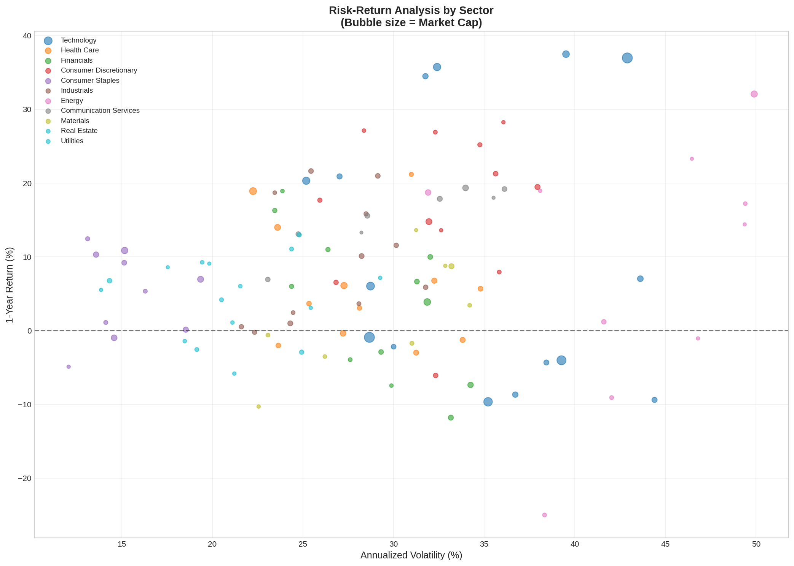
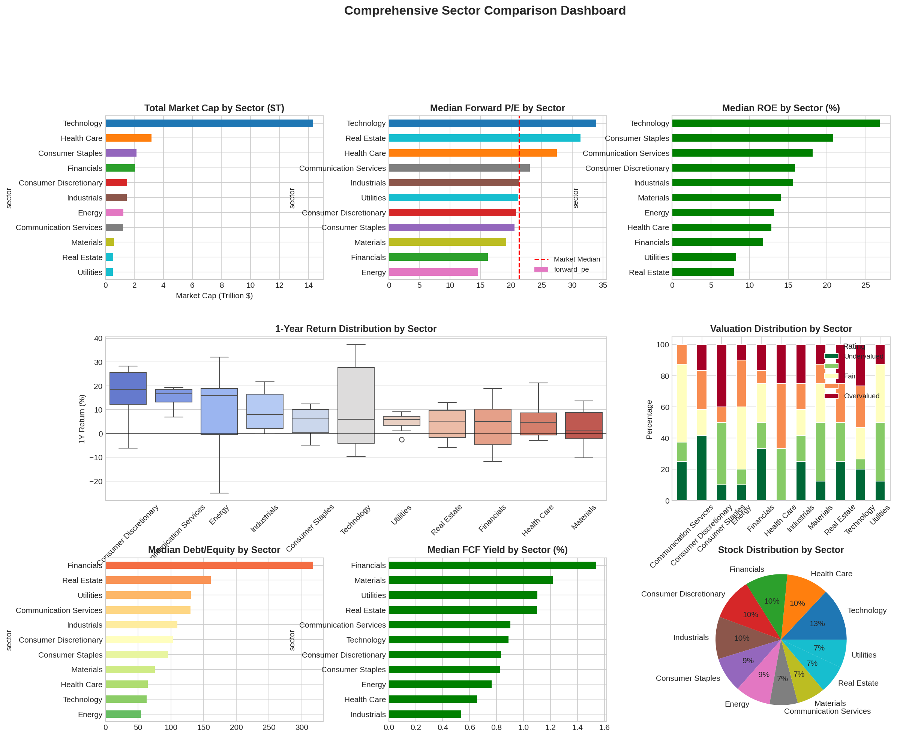
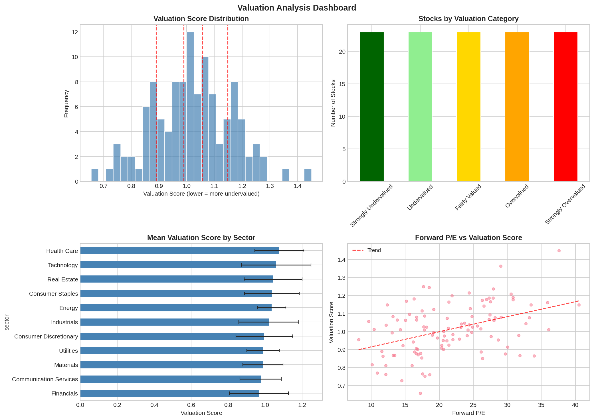

# Comprehensive Sector Analysis System

A professional-grade Python application for analyzing S&P 500 and NASDAQ 100 stocks with **150+ financial metrics**, advanced technical analysis, composite quality scores, and machine learning predictions.

## Table of Contents

- [Overview](#overview)
- [Features](#features)
- [Installation](#installation)
- [Quick Start](#quick-start)
- [Metrics Reference](#metrics-reference)
- [Output Files](#output-files)
- [Visualizations](#visualizations)
- [Architecture](#architecture)
- [Advanced Usage](#advanced-usage)

---

## Overview

This system provides institutional-grade stock analysis capabilities:

- **Complete Index Coverage**: All 503 S&P 500 stocks + 101 NASDAQ 100 stocks
- **11 GICS Sectors**: Information Technology, Health Care, Financials, Consumer Discretionary, Communication Services, Industrials, Consumer Staples, Energy, Materials, Real Estate, Utilities
- **150+ Metrics**: Fundamental, technical, performance, and composite scores
- **Machine Learning**: 5 ML models for performance predictions
- **Comprehensive Visualizations**: 15+ chart types including heatmaps, scatter plots, dashboards

---

## Example Outputs

See what the analysis system produces - comprehensive visualizations that reveal market insights at a glance:

### Risk-Return Analysis by Sector
Interactive bubble chart showing volatility vs. returns across all sectors, with bubble size representing market cap:



### Comprehensive Sector Dashboard
Multi-panel dashboard comparing sectors by market cap, P/E ratios, ROE, returns distribution, debt levels, and more:



### Valuation Analysis Dashboard
In-depth valuation breakdown showing score distributions, sector valuations, and forward P/E correlations:



---

## Features

### 1. Price & Performance Metrics (Absolute)

| Metric | Description | Interpretation |
|--------|-------------|----------------|
| **Cumulative Return** | Total return over period | Higher = better performance |
| **Annualized Return** | Return normalized to 1 year | Enables comparison across timeframes |
| **Maximum Drawdown** | Largest peak-to-trough decline | Measures downside risk |
| **Recovery Time** | Days to recover from drawdown | Shorter = more resilient |
| **Volatility** | Annualized standard deviation | Higher = more risky |
| **Sharpe Ratio** | Risk-adjusted return | >1 = good, >2 = excellent |
| **Sortino Ratio** | Downside risk-adjusted return | Better than Sharpe for asymmetric returns |
| **Calmar Ratio** | Return / Max Drawdown | Higher = better risk-adjusted performance |
| **Omega Ratio** | Probability-weighted gain/loss | >1 = positive risk-adjusted return |
| **VaR (95%)** | Value at Risk | Maximum expected loss at 95% confidence |
| **CVaR (ES)** | Expected Shortfall | Average loss beyond VaR |

### 2. Price & Performance Metrics (Relative)

| Metric | Description | Interpretation |
|--------|-------------|----------------|
| **Alpha** | Excess return vs benchmark | Positive = outperforming |
| **Beta** | Market sensitivity | >1 = more volatile than market |
| **Tracking Error** | Deviation from benchmark | Lower = closer to index |
| **Information Ratio** | Active return / Tracking Error | Measures skill vs benchmark |
| **Up Capture Ratio** | Performance in up markets | >100 = outperforms when market up |
| **Down Capture Ratio** | Performance in down markets | <100 = loses less when market down |
| **R-Squared** | Correlation to benchmark | Higher = more correlated |

### 3. Fundamental Valuation Metrics

#### Profitability
| Metric | Formula | Good Range |
|--------|---------|------------|
| **Gross Margin** | Gross Profit / Revenue | >40% for tech, >20% for retail |
| **Operating Margin** | Operating Income / Revenue | >15% considered good |
| **Net Margin** | Net Income / Revenue | >10% considered good |
| **EBITDA Margin** | EBITDA / Revenue | >20% for most sectors |
| **ROE** | Net Income / Equity | >15% considered good |
| **ROA** | Net Income / Assets | >5% considered good |
| **ROIC** | NOPAT / Invested Capital | >WACC indicates value creation |

#### Valuation Multiples
| Metric | Description | Interpretation |
|--------|-------------|----------------|
| **Trailing P/E** | Price / Historical EPS | Compare to sector average |
| **Forward P/E** | Price / Estimated EPS | Lower than trailing = expected growth |
| **PEG Ratio** | P/E / Growth Rate | <1 = undervalued relative to growth |
| **P/B Ratio** | Price / Book Value | <1 may indicate undervaluation |
| **P/S Ratio** | Price / Revenue | Useful for unprofitable companies |
| **EV/EBITDA** | Enterprise Value / EBITDA | <10 often considered undervalued |
| **EV/Revenue** | Enterprise Value / Revenue | Sector-dependent |
| **P/CF Ratio** | Price / Cash Flow | Lower = better value |
| **FCF Yield** | Free Cash Flow / Market Cap | Higher = more cash generation |
| **Dividend Yield** | Annual Dividend / Price | Income generation |

### 4. Growth Metrics

| Metric | Description | Time Frame |
|--------|-------------|------------|
| **Revenue Growth (YoY)** | Year-over-year revenue change | Annual |
| **Revenue Growth (QoQ)** | Quarter-over-quarter change | Quarterly |
| **Revenue CAGR** | Compound annual growth rate | Multi-year |
| **EPS Growth** | Earnings per share growth | Annual |
| **EBITDA Growth** | EBITDA growth rate | Annual |
| **FCF Growth** | Free cash flow growth | Annual |
| **Sustainable Growth** | ROE x Retention Ratio | Internal growth capacity |

### 5. Balance Sheet & Financial Stability

#### Liquidity Ratios
| Metric | Formula | Good Range |
|--------|---------|------------|
| **Current Ratio** | Current Assets / Current Liabilities | 1.5-3.0 |
| **Quick Ratio** | (CA - Inventory) / CL | >1.0 |
| **Cash Ratio** | Cash / Current Liabilities | >0.5 |

#### Leverage Ratios
| Metric | Formula | Interpretation |
|--------|---------|----------------|
| **Debt/Equity** | Total Debt / Equity | <1.0 for most industries |
| **Debt/Assets** | Total Debt / Total Assets | <0.5 preferred |
| **Debt/EBITDA** | Total Debt / EBITDA | <3.0 considered manageable |
| **Net Debt/EBITDA** | (Debt - Cash) / EBITDA | Better leverage measure |
| **Interest Coverage** | EBIT / Interest Expense | >3.0 considered safe |

### 6. Operational Efficiency

| Metric | Description | Interpretation |
|--------|-------------|----------------|
| **Asset Turnover** | Revenue / Total Assets | Higher = more efficient |
| **Inventory Turnover** | COGS / Avg Inventory | Higher = faster inventory movement |
| **Days Inventory Outstanding** | 365 / Inventory Turnover | Lower = less capital tied up |
| **Receivables Turnover** | Revenue / Avg Receivables | Higher = faster collection |
| **Days Sales Outstanding** | 365 / Receivables Turnover | Lower = faster collection |
| **Cash Conversion Cycle** | DIO + DSO - DPO | Lower = more efficient |
| **Operating Cycle** | DIO + DSO | Time from inventory to cash |

### 7. Technical Indicators

#### Price-Based
| Indicator | Description | Signals |
|-----------|-------------|---------|
| **RSI (14)** | Relative Strength Index | <30 oversold, >70 overbought |
| **MACD** | Moving Average Convergence/Divergence | Crossovers signal trend changes |
| **Bollinger Bands** | Volatility channels | %B <0 oversold, >1 overbought |
| **Moving Averages** | SMA/EMA 20, 50, 100, 200 | Golden/Death cross signals |
| **Stochastic** | %K and %D oscillator | <20 oversold, >80 overbought |
| **Williams %R** | Momentum oscillator | <-80 oversold, >-20 overbought |
| **CCI** | Commodity Channel Index | <-100 oversold, >100 overbought |
| **ADX** | Average Directional Index | >25 = strong trend |
| **Parabolic SAR** | Stop and reverse | Trend following |
| **Ichimoku Cloud** | Multiple trend indicators | Price vs cloud position |
| **ATR** | Average True Range | Volatility measure |
| **Support/Resistance** | Key price levels | Potential reversal points |

#### Volume-Based
| Indicator | Description | Signals |
|-----------|-------------|---------|
| **OBV** | On-Balance Volume | Confirms price trends |
| **VWAP** | Volume-Weighted Avg Price | Institutional benchmark |
| **MFI** | Money Flow Index | <20 oversold, >80 overbought |
| **CMF** | Chaikin Money Flow | >0 buying pressure |
| **A/D Line** | Accumulation/Distribution | Confirms trends |
| **Volume Ratio** | Current / Avg Volume | >1.5 = high volume |

### 8. Composite Quality Scores

#### Altman Z-Score (Bankruptcy Predictor)
```
Z = 1.2xA + 1.4xB + 3.3xC + 0.6xD + 1.0xE

Where:
A = Working Capital / Total Assets
B = Retained Earnings / Total Assets
C = EBIT / Total Assets
D = Market Cap / Total Liabilities
E = Revenue / Total Assets

Interpretation:
Z > 2.99: Safe Zone
1.81 < Z < 2.99: Grey Zone
Z < 1.81: Distress Zone
```

#### Piotroski F-Score (Financial Health: 0-9)
**Profitability (4 points):**
- Positive ROA
- Positive Operating Cash Flow
- ROA improvement vs prior year
- Accrual Quality (CFO > Net Income)

**Leverage/Liquidity (3 points):**
- Decreased leverage (D/E)
- Increased current ratio
- No new shares issued

**Operating Efficiency (2 points):**
- Improved gross margin
- Improved asset turnover

**Interpretation:** 8-9 = Strong, 5-7 = Average, 0-4 = Weak

#### Beneish M-Score (Earnings Manipulation Risk)
```
M-Score > -1.78: Higher manipulation probability
M-Score < -1.78: Lower manipulation probability
```

#### Composite Quality Score (0-100)
Combines profitability, financial strength, growth, and valuation factors into a single score.

### 9. Macro Sensitivity

| Metric | Description | Interpretation |
|--------|-------------|----------------|
| **Beta to Interest Rates** | Sensitivity to TLT | Financial sector typically high |
| **Beta to USD** | Currency sensitivity | Exporters typically negative |
| **Beta to Oil** | Oil price sensitivity | Energy sector typically high |
| **Beta to VIX** | Volatility sensitivity | Defensive stocks typically negative |

### 10. Industry-Specific Metrics

#### Technology
| Metric | Description |
|--------|-------------|
| **R&D/Sales** | Research intensity |
| **Rule of 40** | Revenue Growth + Profit Margin (SaaS) |
| **Magic Number** | Net New ARR / S&M Spend |

#### Financials
| Metric | Description |
|--------|-------------|
| **Net Interest Margin** | NII / Earning Assets |
| **Loan/Deposit Ratio** | Lending vs deposits |
| **Efficiency Ratio** | Non-interest Expense / Revenue |
| **Tier 1 Capital** | Regulatory capital adequacy |

#### Energy
| Metric | Description |
|--------|-------------|
| **Reserve Replacement** | New reserves / Production |
| **Finding Cost** | Exploration cost per barrel |
| **Netback** | Revenue - Costs per BOE |

### 11. Time-Based Analysis

| Analysis | Description |
|----------|-------------|
| **Seasonality** | Average returns by month/quarter |
| **Earnings Momentum** | Post-earnings price patterns |
| **Relative Strength** | Performance vs benchmark over time |

---

## Installation

### Requirements
- Python 3.8+
- pip package manager

### Setup
```bash
# Clone the repository
git clone https://github.com/your-repo/Sector-Analysis.git
cd Sector-Analysis

# Install dependencies
pip install -r requirements.txt
```

### Dependencies
```
yfinance>=0.2.28      # Stock data API
pandas>=2.0.0         # Data manipulation
numpy>=1.24.0         # Numerical computing
matplotlib>=3.7.0     # Visualization
seaborn>=0.12.0       # Statistical plots
scipy>=1.10.0         # Scientific computing
statsmodels>=0.14.0   # Statistical modeling
scikit-learn>=1.3.0   # Machine learning
requests>=2.31.0      # HTTP library
beautifulsoup4>=4.12.0 # Web scraping
lxml>=4.9.0           # XML/HTML parser
tqdm>=4.65.0          # Progress bars
```

---

## Quick Start

### Run Full Analysis (All Stocks)
```bash
cd src
python main.py --output ../output
```

### Run Demo Mode (No Internet Required)
```bash
python main.py --demo --output ../output
```

### Run Sample Analysis (Faster)
```bash
python main.py --sample 50 --output ../output
```

### Run Basic Analysis (Fewer Metrics)
```bash
python main.py --basic --output ../output
```

### Command Line Options
| Option | Description | Default |
|--------|-------------|---------|
| `--sample N` / `-s N` | Analyze only N stocks | All stocks |
| `--output DIR` / `-o DIR` | Output directory | `output` |
| `--skip-plots` | Skip visualization generation | False |
| `--demo` / `-d` | Use simulated demo data | False |
| `--basic` / `-b` | Run basic analysis only | False (comprehensive) |

---

## Output Files

### CSV Files
| File | Description |
|------|-------------|
| `stock_ratings.csv` | Complete stock analysis with all metrics |
| `sector_summary.csv` | Aggregated sector statistics |
| `top_picks_by_sector.csv` | Top undervalued stocks per sector |
| `regression_report.txt` | Statistical model results |

### Visualization Files (PNG)
| File | Description |
|------|-------------|
| `sector_comparison.png` | Multi-panel sector dashboard |
| `sector_heatmap.png` | Metrics heatmap by sector |
| `correlation_matrix.png` | Metric correlations |
| `sector_correlations.png` | Excess return correlations |
| `risk_return_scatter.png` | Risk-return analysis |
| `valuation_distribution.png` | Valuation score distribution |
| `sector_boxplots.png` | Outlier detection by sector |
| `quality_scores_dashboard.png` | Z-Score, F-Score analysis |
| `performance_dashboard.png` | Sharpe, Drawdown analysis |
| `technical_overview.png` | RSI, MACD, ADX distribution |
| `sector_performance_heatmap.png` | Returns by timeframe |

---

## Visualizations

### 1. Multi-Axis Charts
Combined Price + Volume + RSI charts for correlation analysis.

### 2. Sector Heatmaps
Color-coded comparison of metrics across all 11 sectors.

### 3. Risk-Return Scatter Plots
Bubble charts showing risk vs return with market cap sizing.

### 4. Distribution Histograms
Frequency distributions for valuation scores, returns, and technical indicators.

### 5. Waterfall Charts
Decomposition of returns or profit contributions.

### 6. Box Plots
Outlier detection within peer groups.

### 7. Radar/Spider Charts
Multi-factor comparison for individual stocks.

---

## Architecture

```
Sector-Analysis/
├── src/
│   ├── main.py                  # Main orchestrator
│   ├── data_fetcher.py          # Data retrieval (S&P 500 + NASDAQ 100)
│   ├── fundamental_analysis.py  # Valuation ratings & scoring
│   ├── advanced_metrics.py      # Performance metrics
│   ├── comprehensive_metrics.py # 150+ metrics implementation
│   ├── technical_analysis.py    # Technical indicators
│   ├── regression_models.py     # ML & OLS models
│   ├── visualization.py         # Plotting functions
│   ├── demo_data.py             # Simulated data generator
│   └── __init__.py
├── output/                      # Generated outputs
├── requirements.txt             # Python dependencies
└── README.md                    # This file
```

### Module Descriptions

#### data_fetcher.py
- Fetches S&P 500 and NASDAQ 100 tickers from Wikipedia
- Complete fallback list with 500+ stocks
- Retrieves fundamental data via yfinance API
- Handles historical price data and financial statements

#### comprehensive_metrics.py
- **PerformanceMetrics**: Sharpe, Sortino, Calmar, Drawdown, VaR
- **RelativePerformanceMetrics**: Alpha, Beta, Tracking Error, Capture Ratios
- **ProfitabilityMetrics**: ROE, ROA, ROIC, Margins
- **ValuationMetrics**: P/E, P/B, EV/EBITDA, FCF Yield
- **GrowthMetrics**: CAGR, YoY, QoQ growth rates
- **FinancialStabilityMetrics**: Current Ratio, Debt/Equity, Interest Coverage
- **EfficiencyMetrics**: Asset Turnover, Operating Cycle
- **CompositeScores**: Altman Z, Piotroski F, Beneish M, Quality Score
- **MacroSensitivity**: Factor betas
- **IndustryMetrics**: Tech, Financials, Energy specific

#### technical_analysis.py
- Price indicators: RSI, MACD, Bollinger Bands, Stochastic, CCI, ADX
- Volume indicators: OBV, VWAP, MFI, Chaikin Money Flow
- Trend indicators: Parabolic SAR, Ichimoku Cloud
- Support/Resistance detection
- Technical signal generation (Strong Buy to Strong Sell)

#### visualization.py
- Sector comparison dashboards
- Heatmaps and correlation matrices
- Risk-return scatter plots
- Quality score visualizations
- Technical indicator overviews
- Multi-factor radar charts

---

## Advanced Usage

### Programmatic Access
```python
from main import run_analysis

# Run analysis and get results
df, sector_metrics = run_analysis(
    sample_size=100,
    output_dir='my_output',
    skip_plots=False,
    demo_mode=False,
    comprehensive=True
)

# Access results
print(df['ticker'].tolist())
print(df[df['valuation_rating'] == 1])  # Strongly undervalued
```

### Custom Metric Calculation
```python
from comprehensive_metrics import (
    PerformanceMetrics, CompositeScores
)

# Calculate Sharpe Ratio
returns = df['returns']
sharpe = PerformanceMetrics.sharpe_ratio(returns, risk_free_rate=0.04)

# Calculate Z-Score
z_score = CompositeScores.altman_z_score(
    working_capital=1000000,
    total_assets=5000000,
    retained_earnings=500000,
    ebit=300000,
    market_cap=10000000,
    total_liabilities=2000000,
    revenue=8000000
)
```

### Adding New Metrics
```python
# In comprehensive_metrics.py, add to appropriate class:
class ValuationMetrics:
    @staticmethod
    def my_custom_ratio(metric_a, metric_b):
        """Custom valuation ratio"""
        if metric_b is None or metric_b == 0:
            return np.nan
        return metric_a / metric_b
```

---

## Rating System

### Valuation Ratings (1-5)
| Rating | Category | Description |
|--------|----------|-------------|
| 1 | Strongly Undervalued | Top 20% value scores |
| 2 | Undervalued | 20-40% value scores |
| 3 | Fairly Valued | 40-60% value scores |
| 4 | Overvalued | 60-80% value scores |
| 5 | Strongly Overvalued | Bottom 20% value scores |

### Performance Ratings (1-5)
Based on excess returns, revenue growth, ROE, and momentum.

### Technical Signals
| Signal | Score Range | Description |
|--------|-------------|-------------|
| Strong Buy | 40+ | Multiple bullish indicators |
| Buy | 20-40 | Net bullish bias |
| Neutral | -20 to 20 | Mixed signals |
| Sell | -40 to -20 | Net bearish bias |
| Strong Sell | <-40 | Multiple bearish indicators |

---

## Sectors Covered

1. **Information Technology** - AAPL, MSFT, NVDA, etc.
2. **Health Care** - JNJ, UNH, PFE, etc.
3. **Financials** - JPM, BAC, WFC, etc.
4. **Consumer Discretionary** - AMZN, TSLA, HD, etc.
5. **Communication Services** - META, GOOGL, NFLX, etc.
6. **Industrials** - CAT, BA, UPS, etc.
7. **Consumer Staples** - PG, KO, WMT, etc.
8. **Energy** - XOM, CVX, COP, etc.
9. **Materials** - LIN, APD, SHW, etc.
10. **Real Estate** - PLD, AMT, EQIX, etc.
11. **Utilities** - NEE, DUK, SO, etc.

---

## Performance Notes

- **Full Analysis**: ~10-15 minutes for all 500+ stocks
- **Sample Analysis**: ~1 minute for 50 stocks
- **Demo Mode**: <30 seconds (no API calls)
- **Memory Usage**: ~500MB for full analysis

---

## Disclaimer

This tool is for educational and research purposes only. It does not constitute investment advice. Always perform your own due diligence and consult with a qualified financial advisor before making investment decisions.

---

## License

MIT License - See LICENSE file for details.

## Contributing

Contributions are welcome! Please submit pull requests or open issues for bugs and feature requests.
